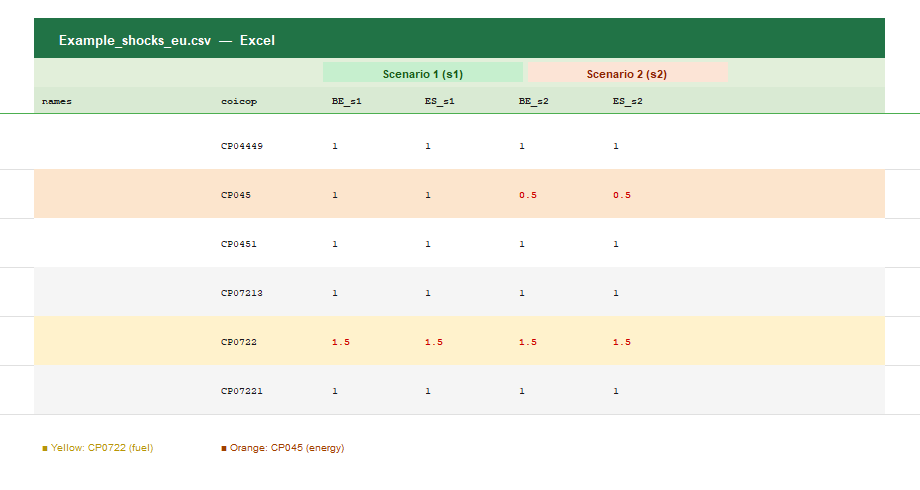
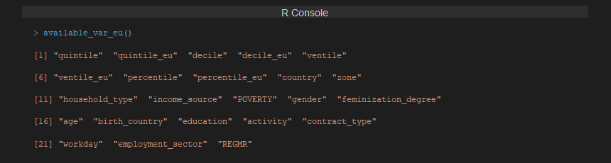
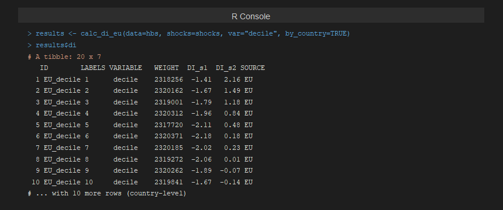
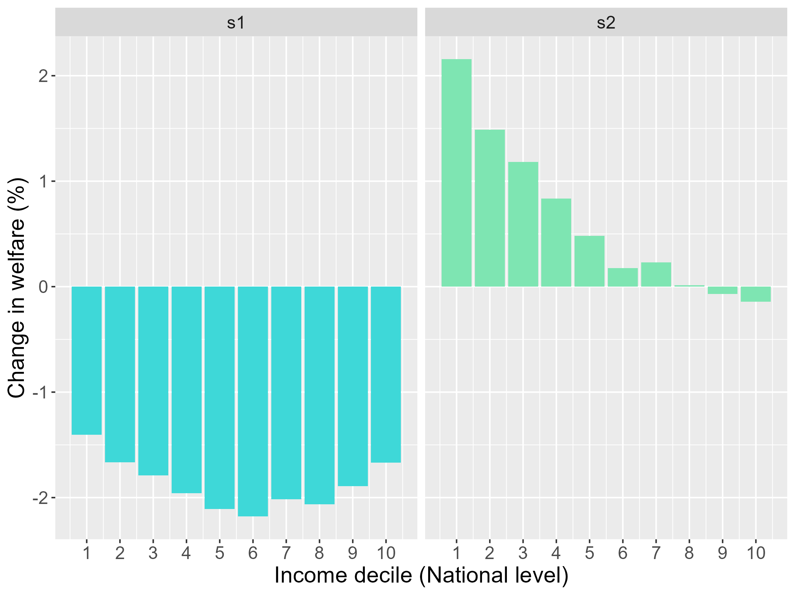
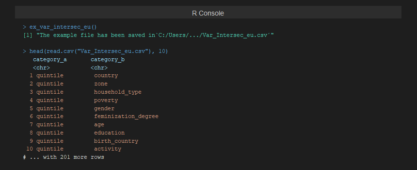
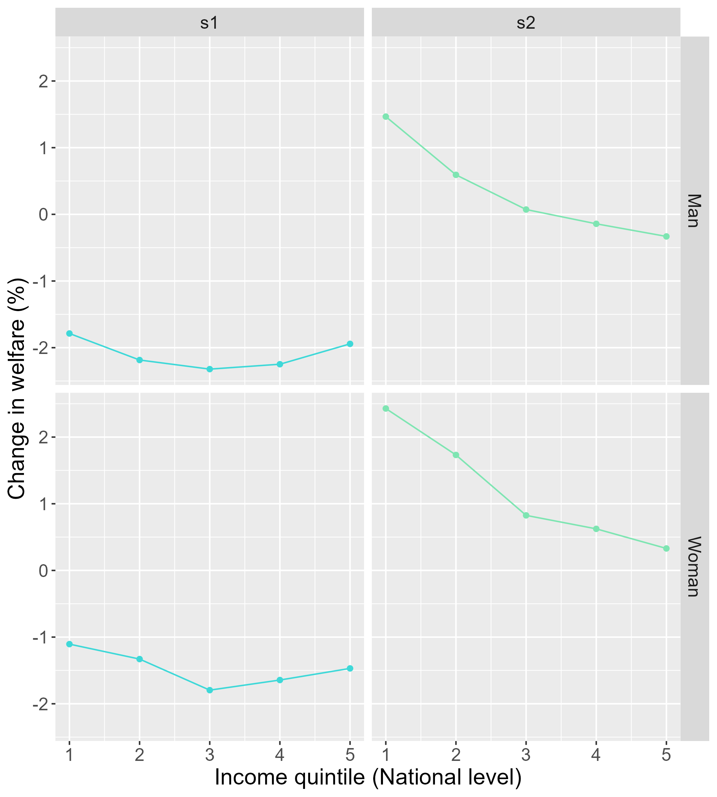

# Step-by-step example (EU)

## Step-by-step example

### Introduction

In this example, we analyse the distributional impacts of energy price
shocks in **Belgium (BE)** and **Spain (ES)** using the 2015 HBS wave,
and compute energy and transport poverty indices for these two
countries.

We consider two scenarios:

- **Scenario 1**: A price shock affecting fuel prices for private
  transportation (+50%), representing the type of shock observed during
  the 2022 energy crisis.
- **Scenario 2**: The same fuel price increase combined with a
  government policy that reduces domestic energy prices by 50%.

------------------------------------------------------------------------

### Step 0: Prepare the data

Process the 2015 HBS microdata for Belgium and Spain using
[`hbs_eu()`](../reference/hbs_eu.md). The raw files must be organised in
the required folder structure (see [Preparing the
data](https://bc3lc.github.io/medusa/articles/TutorialsEU_data.html)).

``` r
library(medusa)

hbs <- hbs_eu(year = 2015,
              country = c("BE", "ES"),
              path = "raw_data")
```

[`hbs_eu()`](../reference/hbs_eu.md) returns a data frame with one row
per household. Expenditure variables follow the COICOP naming convention
and all socioeconomic variables are already included.

------------------------------------------------------------------------

### Step 1: Calculate distributional impacts by income level

#### Define the scenarios

1.  Download the example shocks file:

``` r
ex_shocks_eu()
```

This saves **“Example_shocks_eu.csv”** in your working directory. The
file already contains two scenarios: columns named `CC_s1` (Scenario 1)
and `CC_s2` (Scenario 2), where `CC` is the two-letter country code.

 saves the template to the working directory")

*Figure 1. [`ex_shocks_eu()`](../reference/ex_shocks_eu.md) saves the
two-scenario template CSV to the working directory.*

2.  Open **“Example_shocks_eu.csv”** from your working directory. The
    file contains one row per COICOP category and one column per
    country-scenario combination. All shock values are initialised to
    `1` (no change).


*Figure 2. The template as it comes out of
[`ex_shocks_eu()`](../reference/ex_shocks_eu.md). All values are `1`.
Highlighted rows: CP045 (electricity, gas and other fuels) and CP0722
(fuels for personal transport).*

3.  Enter the price shocks for each COICOP category and scenario. In
    this example:
    - `1.5` in **“Use of personal vehicles”** (CP0722) for all `_s1` and
      `_s2` columns (+50% fuel price increase in both scenarios).
    - `0.5` in **“Electricity, gas and other fuels”** (CP045) for all
      `_s2` columns only (−50% domestic energy policy in Scenario 2).
    - Keep `1` in all other categories.



*Figure 3. The edited shocks file. Red values highlight the cells that
have been modified: CP0722 set to `1.5` in both scenarios, and CP045 set
to `0.5` in Scenario 2 only.*

4.  Save the edited file and load it into R:

``` r
shocks <- read.csv("Example_shocks_eu.csv",
                   header = TRUE,
                   sep = ",",
                   dec = ".")
```

#### Run the distributional impact calculation

5.  Check the variables available for distributional analysis:

``` r
available_var_eu()
```



*Figure 4. Variables available for distributional analysis with
[`calc_di_eu()`](../reference/calc_di_eu.md).*

6.  Calculate distributional impacts by income decile (at national
    level):

``` r
results <- calc_di_eu(data = hbs,
                      shocks = shocks,
                      var = "decile",        # National income deciles
                      by_country = TRUE)     # Results also per country
```

By default, results and figures are saved in the `outputs/` folder of
your working directory.



*Figure 5. R output of [`calc_di_eu()`](../reference/calc_di_eu.md). The
`di` element of the results list contains the distributional impact
(`DI_s1`, `DI_s2`) per income decile, for the EU aggregate and each
country.*

#### Results interpretation

The figures generated by `calc_di_eu` show the relative impact (%) on
total equivalent consumption expenditure across income deciles. A
**negative change** indicates a welfare loss (households bear higher
costs), while a **positive change** indicates a cost reduction.

- In **Scenario 1**, all deciles experience a welfare loss due to higher
  fuel prices, with middle- and higher-income households typically more
  affected as they rely more on private transport.
- In **Scenario 2**, the domestic energy price reduction partially
  offsets the fuel price increase. The benefit is **progressive**,
  concentrating among lower-income households that allocate a larger
  share of their budget to energy.

The figure generated by `calc_di_eu` illustrates the relative impact (%)
on total equivalent consumption expenditure across income deciles:



*Figure 6. Distributional impact by income decile for Scenario 1 and
Scenario 2 (EU level). Negative values indicate a welfare loss; positive
values indicate a cost reduction.*

------------------------------------------------------------------------

### Step 2: Intersectional distributional impacts (income & gender)

7.  Download the intersectional variables file:

``` r
ex_var_intersec_eu()
```

This saves **“Var_Intersec_eu.csv”** in your working directory with all
211 available variable pairs.



*Figure 7. [`ex_var_intersec_eu()`](../reference/ex_var_intersec_eu.md)
saves 211 intersectional variable pairs to the working directory. Only
the pairs whose variables are present in the data will be computed.*

8.  Open **“Var_Intersec_eu.csv”** and keep only the row for the
    combination **`quintile` – `gender`**. Save and reload:

``` r
example_vars <- read.csv("Var_Intersec_eu.csv",
                         header = TRUE,
                         sep = ",",
                         dec = ".")
```

9.  Run the intersectional calculation:

``` r
results_intersec <- calc_di_eu(data = hbs,
                               shocks = shocks,
                               var = NULL,                    # Skip individual variables
                               var_intersec = example_vars,  # Quintile × Gender
                               by_country = TRUE)
```

#### Results interpretation

The intersectional figures show the relative impact across income
quintiles, disaggregated by the gender of the household reference
person.



*Figure 8. Distributional impacts across income quintiles disaggregated
by gender (EU level). The two scenarios are shown side by side for each
quintile-gender group.*

------------------------------------------------------------------------

### Step 3: Energy poverty indices

10. Calculate all energy poverty indices for Belgium and Spain:

``` r
ep <- calc_ep_eu(data = hbs,
                 index = "all")

print(ep)
```

The result is a data frame with five rows (one per index: `10%`, `2M`,
`LIHC`, `HEP`, `HEP_LI`) and one column per country (`BE`, `ES`). Values
represent the proportion of households classified as energy poor in each
country.

11. Save to Excel:

``` r
library(openxlsx)

write.xlsx(ep, "EP_BE_ES_2015.xlsx", sheetName = "Energy poverty")
```

------------------------------------------------------------------------

### Step 4: Transport poverty indices

12. Calculate all transport poverty indices:

``` r
tp <- calc_tp_eu(data = hbs,
                 index = "all")

print(tp)
```

The result follows the same structure: four rows (one per index: `10%`,
`2M`, `LIHC`, `VTU`) and one column per country.

13. Save to Excel:

``` r
write.xlsx(tp, "TP_BE_ES_2015.xlsx", sheetName = "Transport poverty")
```

------------------------------------------------------------------------

### Full script

``` r
library(medusa)

# 0. Prepare data
hbs <- hbs_eu(year = 2015,
              country = c("BE", "ES"),
              path = "raw_data")

# 1. Price shocks
ex_shocks_eu()
# [edit Example_shocks_eu.csv ...]
shocks <- read.csv("Example_shocks_eu.csv", header = TRUE, sep = ",", dec = ".")

# 2. Distributional impacts by income decile
results <- calc_di_eu(data = hbs,
                      shocks = shocks,
                      var = "decile",
                      by_country = TRUE)

# 3. Intersectional impacts (quintile × gender)
ex_var_intersec_eu()
# [edit Var_Intersec_eu.csv ...]
example_vars <- read.csv("Var_Intersec_eu.csv", header = TRUE, sep = ",", dec = ".")
results_intersec <- calc_di_eu(data = hbs,
                               shocks = shocks,
                               var = NULL,
                               var_intersec = example_vars,
                               by_country = TRUE)

# 4. Energy poverty indices
library(openxlsx)
ep <- calc_ep_eu(data = hbs, index = "all")
write.xlsx(ep, "EP_BE_ES_2015.xlsx", sheetName = "Energy poverty")

# 5. Transport poverty indices
tp <- calc_tp_eu(data = hbs, index = "all")
write.xlsx(tp, "TP_BE_ES_2015.xlsx", sheetName = "Transport poverty")
```
